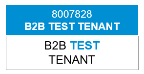
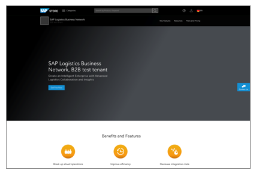
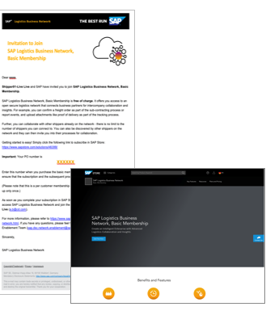

# Title

**do not publish this please. It is still a draft**

## Description (mandatory)

# How To Integrate with SAP LBN APIs - Step by Step Guide

**You can also opt in for SAP Professional Services to help guid you through the process,
please contact us via ICC@SAP.COM**

**You can also opt in for SAP Professional Services to help guid you through the process,
please contact us via ICC@SAP.COM**

**In case of questions please raise an Issue here in [this repository](https://github.wdf.sap.corp/D055590/logistics-business-network-integration/issues)**

## 0.) get yourself familiar with SAP LBN

[Click here](https://sapvideoa35699dc5.hana.ondemand.com/?entry_id=1_kse4obrb) to view a video introduction session for the LBN Network - an introduction for carrier networks!

 

[Click here](https://sapvideoa35699dc5.hana.ondemand.com/?entry_id=1_o1pafhm5)  to view a video introduction to the LBN for API enabled carriers!

Feel free to click through [these slides](Upload/SAP_LBN_FC_FOR_CARRIER_NETWORKS.pdf) to get further information on the carrier networks.

[These slides](Upload/SAP_LBN_FC_FOR_CARRIERS.pdf) will show you more information about API enabled carriers.

* partner edge <link>

## 1.) Get yourself familiar with SAP LBN and APIs

- All API are document in in SAP API hub. To view relevenat api's click on the [link](https://api.sap.com/package/LbnFreightCollaborationTenderingSubcontracting?section=Artifacts) and filter based on Type 'Rest' 

- This video will provide you an overview of the APIs used for various scenarios [Click here](https://sapvideoa35699dc5.hana.ondemand.com/?entry_id=1_56hc08n2)
Additionally to understand details of the individual scenario click on the listed description. You can view the slides used in presentation by clicking on this [link](Upload/OverviewSlides.pptx)
  - [Tendering API](https://sapvideoa35699dc5.hana.ondemand.com/?entry_id=1_arll0fdg)
  - [Subcontracting API](https://sapvideoa35699dc5.hana.ondemand.com/?entry_id=1_0nq8qf49)
  - [Visibility API](https://sapvideoa35699dc5.hana.ondemand.com/?entry_id=1_z9pmf751)

## 2.) Request Tenant and Technical User

 
### A. API Mapping & Testing ###

License 8007828 – Free of Charge *Test tenant to develop & test connectivitywith standard LBN APIs* 

* For Partner Integration phase: Mapping to SAP LBN APIs & end-to-end testing for both Freight Collaboration & Global Track and Trace options 
* Also for Customer Testing / implementation project with testing of integration to the partner network

### B. License Coverage Details
* SAP Logistics Business Network B2B Test Tenant for carriers and network partners
* License to set-up B2B connections for
  * Mapping to SAP Logistics Business Network standard APIs
  * Integration testing 
  * Set-up and testing of B2B connections with SAP Logistics Business Network shipper customer test tenants
* An unlimited number of connections 
* Related usage of SAP Cloud Identity and SAP Fiori
* Standard SAP cloud support for SAP Logistics Business Network and standard APIs

### C. Order the B2B Test Tenant 
* On completion of introduction of your company and solution for SAP Logistics Business Network integration and partnership team via email: LBNPartner@sap.com
* In the SAP Store via Hyperlink[ here](https://www.sapstore.com/solutions/46401/SAP-Logistics-Business-Network%2C-B2B-test-tenant)
* Or [via URL:](https://www.sapstore.com/solutions/46401/SAP-Logistics-Business-Network%2C-B2B-test-tenant)

(NORA 04.11.2020) (Joy/Baoning, Leon)
NEW PROCESS FROM LEON, central e-mail for tenant request - NEED TO BE REFLECTED IN HERE
ADD ALSO SLIDES FROM NATALIE FOR TENANT TYPE EXPLANATION.

To be able to communicate to LBN carriers or network partners have to request for a free test B2B account. Click on the below link and follow the steps in the [link](https://www.sapstore.com/solutions/46401/) to request for a new B2B test account in LBN.

After completion of your request, you will be provided with a login URL to SAP LBN and also credentials. Please use these URL and credentials to access LBN UIs and for maintaining configurations. 

## 3.) Integrate against SAP LBN APIs

You may use these [sample payload](Upload/SamplePayload/) to build your mappings and endpoints.

When the API s are ready, you can configure the endpoints to our test landscape. To configure them, you will have to login to SAP LBN and maintain your endpoints that SAP LBN needs to call. You may refere this [video](https://video.sap.com/media/t/1_igc0uy3u) to view how to setup outbound connections and inbound connections. 

For all the LBN provider APIs(inbound to LBN), when you call our endpoint, you would need to  procure an OAuth 2.0 client Id and secret. This can be procured by reporting an incident. Use the application component - SCM-LBN-INT in [sap support portal](support.sap.com) Please mention the LBNID created for you account. To know the LBN ID, login to SAP LBN  and open the business profile tile.

The OAuth Id will be needed by you to call our endpoint for all the provider APIs.

The [LBN endpoint](ttps://l20398-iflmap.hcisbp.eu1.hana.ondemand.com/http/v1h) that you need to call:

During this step, SAP Will invite your test tenant to a dummy shipper tenant for test puruposes.  You would have to accept the invitation by logging in to you LBN tenant and Navigating to Manage Invitation tile.

Below [application link](https://help.sap.com/viewer/185742008f2c477ca789b93675b0ec6c/LBN/en-US/011fbcd85017450587389c4a10190077.html) help will guide you on how to configure you endpoint in our app.

## 4.) Testing 

- To test , you can generate an test call from the system connection app. you may refer the document [here](https://help.sap.com/viewer/185742008f2c477ca789b93675b0ec6c/LBN/en-US/21f87b4b5d1547a5b7c185be5e764203.html) on how to generate a test payload

## 5.) Release for Productive Usage

### A. Customer Connectivity
License 8007133 – Free of charge
**Productive tenant for connectivity and transaction processing / data sharing with shippers*** 
* Covers both Freight Collaboration & Global Track and Trace options
* Enables business partner entry and discovery in the business partner directory 
* Enables listing and representation in SAP Logistics Business Network go-to-market materials

### B. License Coverage Details

* SAP Logistics Business Network membership as a carrier or network partner
* License to collaborate / transact with connected shipper customers via the SAP Logistics Business Network for:
  * Freight Requests for Quotation and freight order confirmation / rejectiion 
  * Order tracking 
  * Web-based access for documents exchange
* An unlimited number of connections 
* Related usage of SAP Cloud Identity and SAP Fiori
* Standard SAP cloud support for SAP Logistics Business Network and standard APIs

### C.1  Request Productive Membership Invitation: 
* On completion of mapping and integration testing only
* Invitation request to be sent to network enablement validation via email: sap.dsc.network.enablement@sap.com 
### C.2   Order the Basic Membership License
* In the SAP Store via Hyperlink here
* Or via URL:https://www.sapstore.com/solutions/46399/SAP-Logistics-Business-Network%2C-Basic-Membership
* Using your purchase order number provided in the invitation email sent from network enablement 

(NORA 04.11.2020) (Joy/Baoning/Leon)
* Get onboarded to LBN productive tenant

To be able to communicate to LBN carriers or network partners have to request for a free productive account. Click on the [link](https://www.sapstore.com/solutions/46399/) and follow the steps in the link to request for a new productive account in LBN.

https://www.kaltura.com/p/1921661/sp/192166100/embedIframeJs/uiconf_id/37285991/partner_id/1921661?iframeembed=true&playerId=kaltura_player&entry_id=1_87fynq6n

(Ravish)
* Request access to LBN endpoint for productive tenant

For all the LBN provider APIs, when you call our endpoint, you would need to request or procure an OAuth 2.0 client Id and secret. This can be procured by reporting an incident . Use the  application component - SCM-LBN-INT in sap support portal(support.sap.com) Please mention the LBNID created for you account. To know the LBN ID, login to SAP LBN and open the business profile tile.

The OAuth Id will be needed by you to call our endpoint for all the provider APIs.

The [LBN endpoint](https://l20398-iflmap.hcisbp.eu1.hana.ondemand.com/http/v1
) that you need to call:

The step above is same as the one you have request for test access. But the OAuth ID and secret will be separate for productive access.

* Configure system connection in LBN for productive tenant.Repeat the activities carried out on System connection App in the test tenant ( [Click here](https://video.sap.com/media/t/1_igc0uy3u) ). This time maintain your productive URL

Follow activities as done in step 6 to your productive URLs

(Ravish)
* Quality Gate - Smoke test in productive
Raise an incident in SCM-LBN-INT for a smoke test. We will facilitate an example order to your system . This activity will be done manually. 
Here we should check against a list of acceptance criteria (we want to prove they really offer the functionality they claim).

## Requirements

## Download and Installation

## Known Issues

## How to obtain support (mandatory(

## Contributing

## License (mandatory)
Copyright (c) 2020 SAP SE or an SAP affiliate company. All rights reserved. This project is licensed under the Apache Software License, version 2.0 except as noted otherwise in the [LICENSE](LICENSES/Apache-2.0.txt) file.
