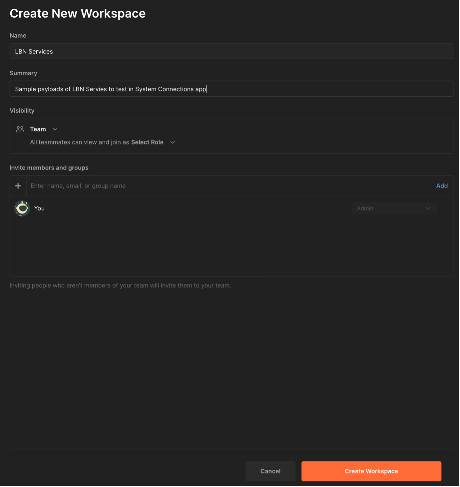
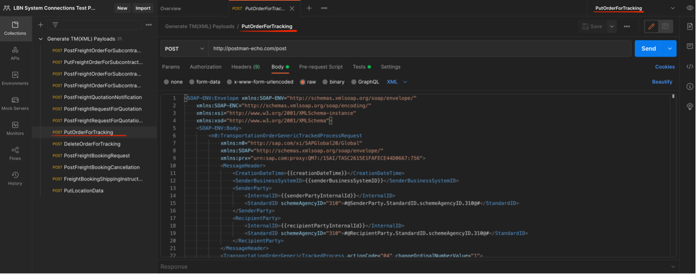
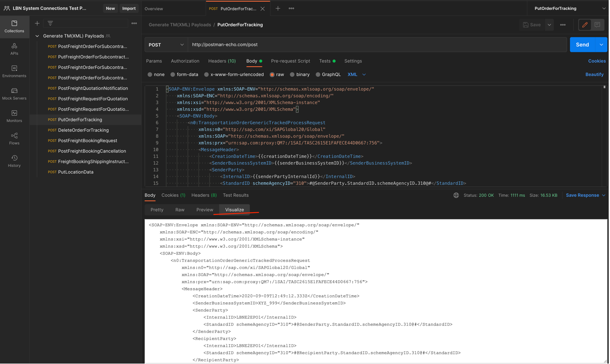

  
1. In order to generate custom payloads for testing shipper messages in LBN, we recommend creating a new workspace in your postman and importing the postman collection and environments provided in this repo.

2. Import the postman collections and all the environments and ensure that you’ve selected the correct pair of environment and request based on the operation name

  
  3. You can find a basic set of information that can be changed in the environment variables. Here you’ll be able to change the dates/category code/shipment type/shipment parties etc. Please note that the key fields such as shipper/carrier LBN id, document id etc. are not customizable fields and is determined in the backend. 

  Feel free to alter the structure to fit the business use-case to achieve the functionality (eg: multi-stop shipments etc.). Make sure that the payload is a valid     SOAP payload and the necessary place holders for document id and shipper-carrier LBN ids are not changed
  
  
  4.	Once the necessary info is filled in environment variables and the changes are done, hit on send. You should get the SOAP message in visualize tab in response ‘Body’ section.
 
